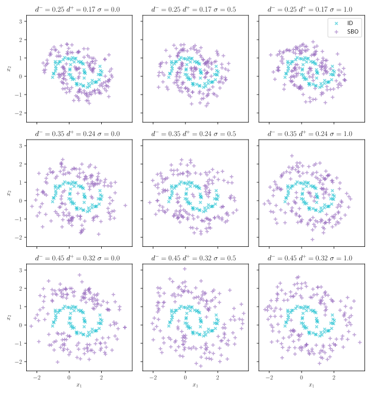

# soft-brownian-offset
Soft Brownian Offset (SBO) defines an iterative approach to translate points by a most likely distance from a given dataset.

## Background

The technique is described in detail within the paper **TBA**. For citations please see [*cite*](#cite).

## Installation

This project is hosted on [PyPI](https://pypi.org/project/sbo/) and can therefore be installed easily through `pip`:

```
pip install sbo
```

Dependending on your setup you may need to add `--user` after the `install`.

## Demonstration



The following code creates the plot seen above:

```python
#!/usr/bin/env python3
# Creates a plot for Soft Brownian Offset (SBO)

import numpy as np
import pylab as plt
import itertools
import sys

from matplotlib import cm
from sklearn.datasets import make_moons

from sbo import soft_brownian_offset, gaussian_hyperspheric_offset

plt.rc('text', usetex=True)

c = cm.tab10.colors

def plot_data(X, y, ax=plt):
    ax.scatter(X[:, 0], X[:, 1], marker='x', s=20, label='ID', alpha=alpha, c=[c[-1]])
    ax.scatter(y[:, 0], y[:, 1], marker='+', label='SBO', alpha=alpha, c=[c[-6]])
    
def plot_mindist(X, y, ax=plt):
    if len(X.shape) == 1:
        X = X[:, None]
    if len(y.shape) == 1:
        y = y[:, None]
    ax.hist(pairwise_distances(y, X).min(axis=1), bins=len(y) // 10)
    ax.set_xlabel("Minimum distance from ood to id")
    ax.set_ylabel("Count")
    
def plot_data_mindist(X, y):
    fig, ax = plt.subplots(1, 2)
    plot_data(X, y, ax=ax[0])
    plot_mindist(X, y, ax=ax[1])
    plt.show()


n_samples_id = 60
n_samples_ood = 150
noise = .08
show_progress = False
alpha = .6

n_colrow = 3
d_min = np.linspace(.25, .45, n_colrow)
softness = np.linspace(0, 1, n_colrow)
fig, ax = plt.subplots(n_colrow, n_colrow, sharex=True, sharey=True, figsize=(8.5, 9))

X, _ = make_moons(n_samples=n_samples_id, noise=noise)
for i, (d_min_, softness_) in enumerate(itertools.product(d_min, softness)):
    xy = i // n_colrow, i % n_colrow
    d_off_ = d_min_ * .7
    ax[xy].set_title(f"$d^- = {d_min_:.2f}\ d^+ = {d_off_:.2f}\ \sigma = {softness_}$")
    if softness_ == 0:
        softness_ = False
    y = soft_brownian_offset(X, d_min_, d_off_, n_samples=n_samples_ood, softness=softness_, show_progress=show_progress)
    plot_data(X, y, ax=ax[xy])
    if i // n_colrow == len(d_min) - 1:
        ax[xy].set_xlabel("$x_1$")
    if i % n_colrow == 0:
        ax[xy].set_ylabel("$x_2$")
ax[0, n_colrow - 1].legend(loc='upper right')

plt.tight_layout()
plt.savefig('assets/sbo-demo.svg')
```

## Cite

Please cite SBO in your paper if it helps your research **TBA**:

```
@article{name2020sbo,
  Author = {TBA},
  Journal = {arXiv preprint arXiv:TBA},
  Title = {TBA},
  Year = {2020}
}
```


